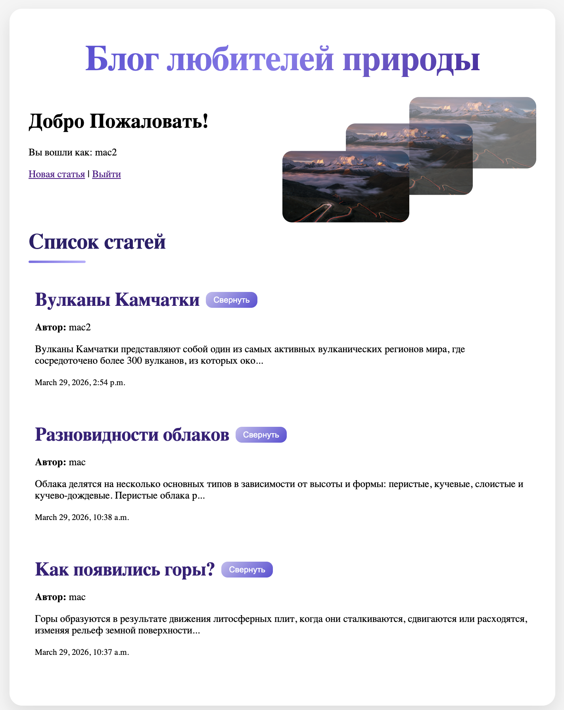
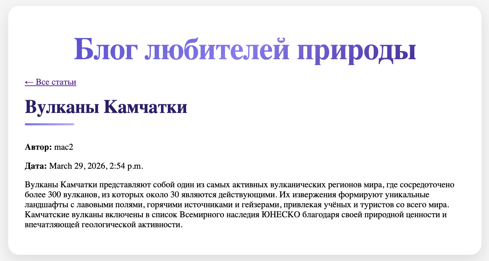
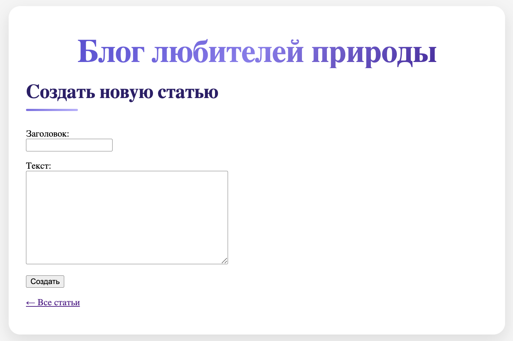
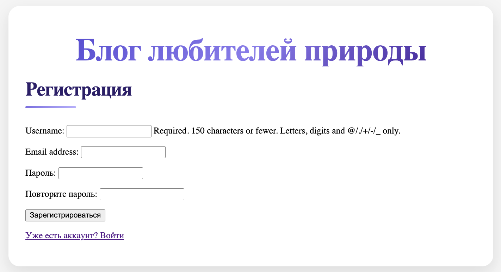
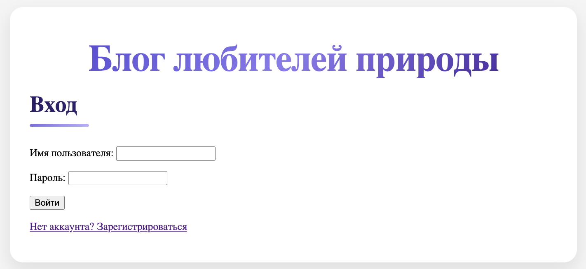

# 🌿 Nature Blog — Django Web Application


Современный веб-блог на Django с аутентификацией, управлением статьями и интерактивным интерфейсом.

---

## 🚀 Demo

> После запуска доступно по адресу:
> **http://127.0.0.1:8000/**

---

## ✨ Основные возможности

* 🔐 Регистрация / вход / выход пользователей
* ✍️ Создание и просмотр статей (CRUD-основа)
* 👤 Привязка статей к автору
* 📄 Список статей с датой публикации
* 🎯 Сворачивание/разворачивание постов (JS)
* 🎨 Hover-эффекты и кастомные кнопки
* 🖼️ Параллакс в шапке (scroll-based animation)
* 💎 Центрированный layout, карточки, тени, градиенты

---

## 📸 Preview







---

## 🧱 Стек технологий

* **Backend:** Django, Python
* **Frontend:** HTML, CSS, JavaScript (jQuery)
* **DB:** SQLite
* **Templates:** Django Templates
* **Static:** CSS / JS / Images

---

## ⚙️ Установка и запуск

```bash
# Клонировать репозиторий
git clone https://github.com/helena6421/git-project.git

# Перейти в папку проекта
cd git-project

# Создать виртуальное окружение
python -m venv venv

# Активировать
source venv/bin/activate      # macOS / Linux
venv\Scripts\activate         # Windows

# Установить зависимости
pip install -r requirements.txt

# Миграции
python manage.py migrate

# Запуск
python manage.py runserver
```

Открыть в браузере:

```
http://127.0.0.1:8000/
```

---

## 🔑 Функционал

### 👥 Пользователи

* регистрация (валидация, уникальность username)
* вход/выход через Django auth
* отображение текущего пользователя

### 📝 Статьи

* создание статьи (только для авторизованных)
* список статей
* детальная страница статьи
* сворачивание/разворачивание контента

### 🎨 Интерфейс

* карточки статей с hover-эффектами
* кастомные кнопки
* параллакс-анимация (разные скорости слоёв)
* центрированный контейнер с тенями

---

## 💡 Особенности реализации

* Использован `ModelForm` + корректное хэширование пароля (`set_password`)
* Встроенная система аутентификации Django
* Разделение логики:

  * JS → поведение
  * CSS → отображение
* Параллакс через обработку события `scroll`
* Интерактивность без перезагрузки (частично, через JS)

---

## 📌 Автор

**Алёна Ласкина** | Frontend Developer
